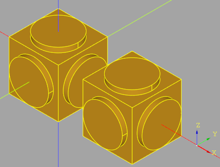
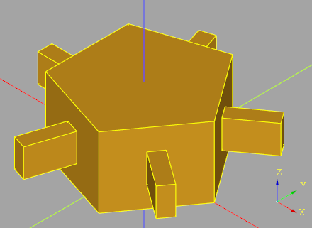
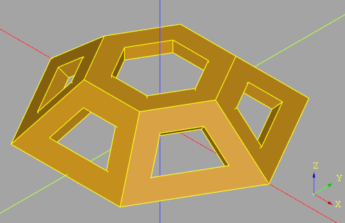
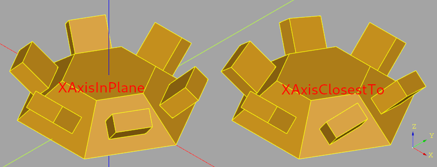

# Apply To Each Face plugin

This plugin simplifies using 
`Workplane.each(..)` on faces. 
To use each you have to select workplane coordinate 
system for each face before building your geometry. 
`Workplane.applyToEachFace()` function provided by 
this plugin separates tasks of choosing face coordinate 
system and actually building new geometry and provides 
a few built in ways of choosing coordinate system that 
are good enough in many cases.


## Installation

```bash
pip install -e "git+https://github.com/CadQuery/cadquery-plugins.git#egg=apply_to_each_face&subdirectory=plugins/apply_to_each_face"
```
You can also clone the repository of the plugin and 
run in the repository the following command:
```bash
python setup.py install
```

## Dependencies

This plugin has no dependencies other than the cadquery library.

## Usage

To use this plugin after it has been installed, 
just import it and use `applyToEachFace(..)`
method of `Workplane`. To use this plugin in `CQ-editor` 
you have to
- either (preferably) untick `Edit -> Preferences -> Debugger -> Reload CQ` 
  option 
- or reload `apply_to_each_face` module on each run 
like so
```python
if "apply_to_each_face" in sys.modules:
    del sys.modules["apply_to_each_face"]
```

If none of the above is done second and subsequent runs 
of a script using `apply_to_each_face` in CQ-Editor will fail.

`applyToEachFace(..)` method has two arguments both of which are callbacks. 

1. `f_workplane_selector(face)` callback accepts a face and returns 
    CadQuery Workplane instance that is passed to the next callback.
    Two variants of this callback are provided both of which
    choose workplane center of origin at face center (`Face.Center()`) and
    face normal at face center as Z axis. They have different
    methods of X axis selection
    1. `XAxisInPlane` (recommended in most cases) - a callable that chooses
      x axis that is simultaneously perpendicular to face normal at center
      and belongs to one of user-provided planes (specified by their 
      normal vectors). Plane normal vectors are checked in the order 
      they are provided and the first one that is not collinear with 
      face normal is used.
      The plugin provides the following plane lists
      - `WORLD_AXIS_PLANES_XY_ZX_YZ`
      - `WORLD_AXIS_PLANES_XY_YZ_ZX`
      - `WORLD_AXIS_PLANES_YZ_XY_ZX`
      - `WORLD_AXIS_PLANES_YZ_ZX_XY`
      - `WORLD_AXIS_PLANES_ZX_XY_YZ`
      - `WORLD_AXIS_PLANES_ZX_YZ_XY`
    2. `XAxisClosestTo` - a callable that chooses x axis 
       perpendicular to face normal at face center as 
       close as possible to one of user-specified unit 
       vectors (usually world coordinate system axis unit 
       vectors).
       Vectors are checked in the order they are provided 
       and the first one that is not collinear with face 
       normal is used.
       The plugin provides the following vector lists
       - `WORLD_AXIS_UNIT_VECTORS_XYZ`
       - `WORLD_AXIS_UNIT_VECTORS_XZY`
       - `WORLD_AXIS_UNIT_VECTORS_YXZ`
       - `WORLD_AXIS_UNIT_VECTORS_YZX`
       - `WORLD_AXIS_UNIT_VECTORS_ZXY`
       - `WORLD_AXIS_UNIT_VECTORS_ZYX`    
2. `f_draw(wp_face, face)` callback creates geometry at each face using 
   `face` itself and workplane `wp_face` provided by `f_workplane_selector`

User-provided vectors  for both `XAxisInPlane` and `XAxisClosestTo` do not
have to be linearly independent but their span (linear hull) should be all
3D vector space for these face coordinate system selectors to work on 
arbitrary faces. In some cases this requirement can be relaxed.

## Examples

### Example 1
```python
import sys
import cadquery as cq

from apply_to_each_face import (
    XAxisInPlane,
    WORLD_AXIS_PLANES_XY_ZX_YZ,
)


def main_body():
    return (
        cq.Workplane("XY")
        .box(10.0, 10.0, 10.0, centered=(True, True, True))
        .union(
            cq.Workplane("XY")
            .move(15, 0)
            .box(
                10.0,
                10.0,
                10.0,
                centered=(True, True, True),
            )
        )
    )


result = main_body().union(
    main_body()
    .faces()
    .applyToEachFace(
        XAxisInPlane(WORLD_AXIS_PLANES_XY_ZX_YZ),
        lambda wp, face: wp.circle(4).extrude(1),
    )
)
```



### Example 2
```python
import sys
import cadquery as cq

from apply_to_each_face import (
    XAxisInPlane,
    WORLD_AXIS_PLANES_XY_YZ_ZX,
)


def main_body():
    return cq.Workplane("XY").polygon(5, 10.0).extrude(5)


result = main_body().union(
    main_body()
    .faces("#Z")
    .applyToEachFace(
        XAxisInPlane(WORLD_AXIS_PLANES_XY_YZ_ZX),
        lambda wp, face: wp.rect(1, 2).extrude(3),
    )
)
```


### Example 3

```python
import sys
import cadquery as cq

from apply_to_each_face import (
    XAxisInPlane,
    WORLD_AXIS_PLANES_XY_ZX_YZ,
)


def main_body():
    return (
        cq.Workplane("XY")
        .polygon(6, 10.0)
        .extrude(3, taper=45)
    )


result = (
    main_body()
    .faces("<Z")
    .shell(-0.5)
    .cut(
        main_body()
        .faces("not <Z")
        .applyToEachFace(
            XAxisInPlane(WORLD_AXIS_PLANES_XY_ZX_YZ),
            lambda wp, face: wp.add(face)
            .wires()
            .toPending()
            .offset2D(-0.8)
            .extrude(-2),
        )
    )
)
```


### Example 4

```python
import sys
import cadquery as cq

from apply_to_each_face import (
    XAxisInPlane,
    WORLD_AXIS_PLANES_XY_ZX_YZ,
    XAxisClosestTo,
    WORLD_AXIS_UNIT_VECTORS_XYZ,
)


def main_body():
    return (
        cq.Workplane("XY")
        .polygon(6, 10.0)
        .extrude(3, taper=45)
    )


result_x_axis_in_plane = main_body().union(
    main_body()
    .faces("#Z")
    .applyToEachFace(
        XAxisInPlane(WORLD_AXIS_PLANES_XY_ZX_YZ),
        lambda wp, face: wp.rect(2, 1).extrude(2),
    )
)

result_x_axis_closest_to = (
    main_body()
    .union(
        main_body()
        .faces("#Z")
        .applyToEachFace(
            XAxisClosestTo(WORLD_AXIS_UNIT_VECTORS_XYZ),
            lambda wp, face: wp.rect(2, 1).extrude(2),
        )
    )
    .translate(cq.Vector(8, 8, 0))
)
```



### Example 5

```python
import sys
import cadquery as cq

from apply_to_each_face import (
    XAxisInPlane,
    WORLD_AXIS_PLANES_XY_ZX_YZ,
    XAxisClosestTo,
    WORLD_AXIS_UNIT_VECTORS_ZXY,
)


def main_body():
    return (
        cq.Workplane("XY")
        .rect(10.0, 10.0)
        .extrude(5, both=True)
    )


result = (
    main_body()
    .union(
        main_body()
        .faces()
        .applyToEachFace(
            XAxisClosestTo(WORLD_AXIS_UNIT_VECTORS_ZXY),
            lambda wp, face: wp.add(face)
            .wires()
            .toPending()
            .twistExtrude(10, 45),
        )
    )
    .edges()
    .fillet(3)
)
```  


