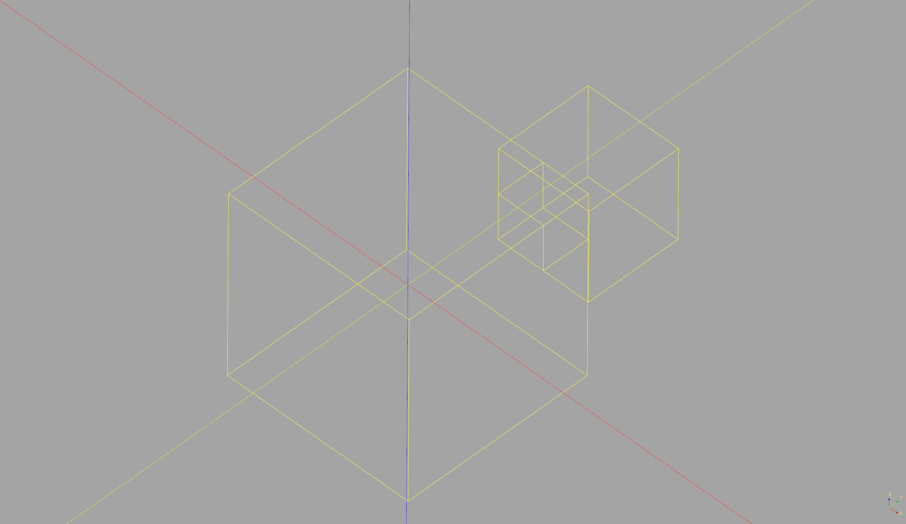

# Fragment

Apply boolean fragment to solids. See https://dev.opencascade.org/doc/overview/html/specification__boolean_operations.html#specification__boolean_7 

## Installation

```
pip install -e "git+https://github.com/CadQuery/cadquery-plugins.git#egg=fragment&subdirectory=plugins/fragment"
```
You can also clone the repository of the plugin and run in the repository the following command:
```
python setup.py install
```

## Usage

To use this plugin, import it to automatically patch the `fragment` method into the `cadquery.Workplane` class. The `fragment` function should be available after import, but be sure to import `cadquery` first.  


```python
import cadquery as cq
import fragment  # Adds the fragment function to cadquery.Workplane

plate = cq.Workplane('XY').box(20,20,20)
plate2 = cq.Workplane('XY').box(10,10,10).translate((10,10,10))
plate = plate.fragment(plate2)

```




