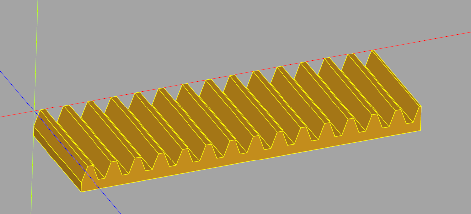
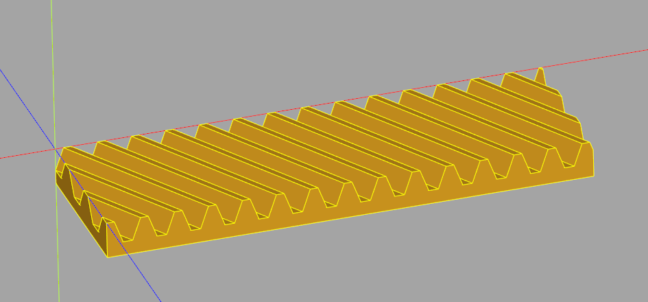
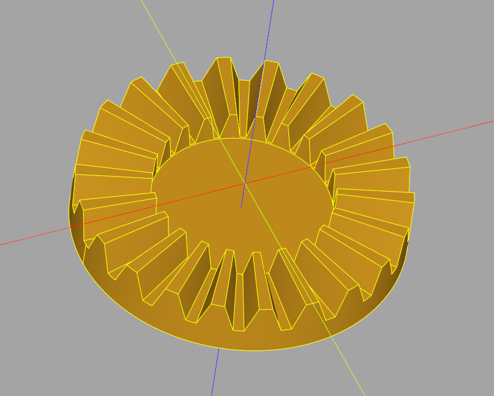

# Gear generator

This plugin provide additionals methods to create various gears. 
As for now you can create these gears (all the gears are involutes):
* Spur gear


* Helical gear


* Rack gear 



* Helical rack gear



* Crown (or face) gear



* Bevel gear (straight) (experimental)


* Bevel gear system (straight) (very experimental)


## Installation

To install this plugin, the following line should be used.

```
pip install -e "git+https://github.com/CadQuery/cadquery-plugins.git#egg=gear_generator&subdirectory=plugins/gear_generator"
```


## Dependencies

This plugin has no dependencies other than the cadquery library.

## Usage

To use this plugin after it has been installed, just import it and use the make_... methods to create your gears
```python
import cadquery as cq
import gear_generator # automatically links the plugin functions to the cq.Workplane class

module = 2
nb_teeth = 12
width = 8
gear = cq.Workplane("XY").make_gear(module, nb_teeth, width)
```


Currently in cq-editor the automatical linking doesn't work so you should try to link it manually as below : 
```python
import cadquery as cq 
import gear_generator
gear_generator.cutter_objects.register_cutter_objects()
gear_generator.register()
```

Below is the list of implemented methods :
```python
cq.Workplane().make_gear(params)
cq.Workplane().make_rack_gear(params)
cq.Workplane().make_crown_gear(params)
cq.Workplane().make_bevel_gear(params)
cq.Workplane().make_bevel_gear_system(params)

#You can get info about the parameters by running 
help(cq.Workplane().make_gear)
>>> _make_gear(m, z, b, alpha=20, helix_angle=None, raw=False) method of cadquery.cq.Workplane instance
>>>     Creates a spur or helical involute gear
>>> 
>>>     Parameters
>>>     ----------
>>>     m : float
>>>         Spur gear modulus
>>>     z : int
>>>         Number of teeth
>>>     b : float
>>>         Tooth width
>>>     alpha : float
>>>         Pressure angle in degrees, industry standard is 20\ufffd
>>>     helix_angle : float
>>>         Helix angle of the helical gear in degrees
>>>         If None creates a spur gear, if specified create a helical gear
```
