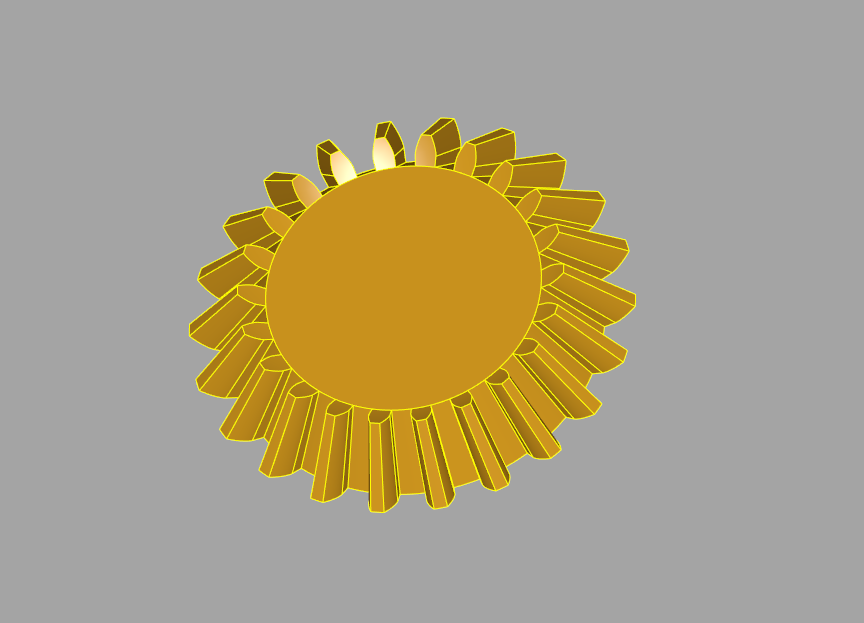

# Gear generator

This plugin provide additionals methods to create various gears. 
As for now you can create these gears (all the gears are involutes):
* Spur gear

* Helical gear

* Rack gear 

* Crown (or face) gear

* Bevel gear (straight) (experimental)

* Bevel gear (straight) (very experimental)


## Installation

To install this plugin, the following line should be used.

```
pip install -e "git+https://github.com/CadQuery/cadquery-plugins.git#egg=gear_generator&subdirectory=plugins/gear_generator"
```


## Dependencies

This plugin has no dependencies other than the cadquery library.

## Usage

To use this plugin after it has been installed, just import it and use the make_... methods to create your gears

```python
# Import the Hollow Sphere Selector
import cadquery as cq
import gear_generator # link the plugin functions to the cq.Workplane class
from gear_generator import make_gear

module = 2
nb_teeth = 20
width = 5
gear = cq.Workplane("XY").make_gear(module, nb_teeth, width)

```
