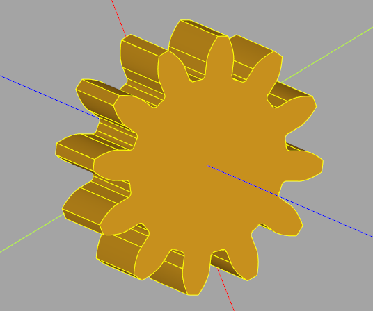

# Gear generator

This plugin provide classes to create various gears. 
As for now you can create these gears (all the gears are involutes):
* Spur gear


* Helical gear


* Bevel gear (straight and helical)


* Bevel gear system (straight and helical)


## Installation

To install this plugin, the following line should be used.

```
pip install -e "git+https://github.com/CadQuery/cadquery-plugins.git#egg=gear_generator&subdirectory=plugins/gear_generator"
```


## Dependencies

This plugin has no dependencies other than the cadquery library.

## Usage

To use this plugin after it has been installed, import it and create Gear objects
```python
import cadquery as cq
import gear_generator

module = 2
nb_teeth = 12
width = 8
gear = Gear(module, nb_teeth, width).build() #Instantiate a gear object and call it's build method to get the gear in a cq.Workplane
```


Below is the list of implemented gear classes :
```python
Gear(args)
BevelGear(args)
BevelGearSystem(args)

#You can get info about the parameters by running 
help(BevelGear)

Help on class Gear in module gear_generator.main:

class Gear(BaseGear)
 |  Gear(m: float, z: int, b: float, alpha: float = 20, helix_angle: float = 0, raw: bool = False)
 |
 |  Base gear class
 |  This class stores attributes that are shared by any types of gear
 |  Other gear classes inherit from this class
 |
 |  Attributes :
 |      m : gear modulus
 |      b : gear tooth facewidth
 |      z : gear number of teeth
 |      p : gear pitch
-- Suite  --
```
