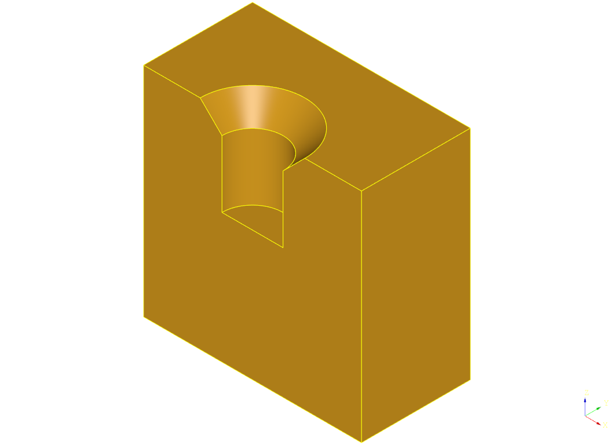

# Heatserts

Generates a hole that accepts a heatsert. Heatserts are often used in 3D printed parts. Values included that fit my M3, M4, M5 and M6 heatserts, YMMV.

## Installation

```
pip install -e "git+https://github.com/CadQuery/cadquery-plugins.git#egg=heatserts&subdirectory=plugins/heatserts"
```
You can also clone the repository of the plugin and run in the repository the following command:
```
python setup.py install
```

## Dependencies

This plugin has no dependencies other than the cadquery library.

## Usage

To use this plugin after it has been installed, import it to automatically patch the `heatsert` method into the `cadquery.Workplane` class. The `heatsert` function should be available after import, but be sure to import `cadquery` first.

Also see the docstring on the `heatsert` method for a description of it's arguments.

```python
import cadquery as cq
import heatserts  # Adds the heatsert function to cadquery.Workplane

result = (
    cq.Workplane()
    .box(100, 100, 10)
    .faces(">Z")
    .wires()
    .toPending()
    .offset2D(-5, forConstruction=True)
    .vertices()
    .heatsert("M4")
)
```

The user can fine tune the dimensions of the heatsert hole (to suit their brand of heatserts or to add clearance at the bottom of the hole), or add new heatserts. To add a new M8 heatsert (numbers are not accurate):
```python
import cadquery as cq
import heatserts as heatsert_module

heatsert_module.heatsert_dims["M8"] = heatsert_module.dims(
    diam=10, depth=15, bolt_diam=8
)

result = cq.Workplane().box(10, 10, 10).faces(">Z").workplane().heatsert("M8")
```

### Options

A plain heatsert like:

```python
result = cq.Workplane().box(10, 10, 10).faces(">Z").heatsert("M4")
```

Creates a simple hole with the diameter and depth for an M4 heatsert:


#### Extra bolt clearance

The `bolt_clear` option adds an extra, smaller diameter hole to the bottom for longer threaded fasteners. The distance is measured from the surface (so `bolt_clear=1` will do nothing because it does not extend beyond the heatsert). 

```python
result.heatsert("M4", bolt_clear=15)`
```


#### Single chamfer

A chamfer can be added to the top of the hole.

```python
result.heatsert("M4", chamfer=2)`
```



#### Double chamfer

Two values for the chamfer can be specified. The first value is used for the setback on the face, the second is used for the setback depth into the hole.

```python
result.heatsert("M4", chamfer=(1, 5))`
```


#### Clean

This option is passed on to the lower level methods and will attempt to "clean up" the resulting solid. It should usually be left at `True`.
