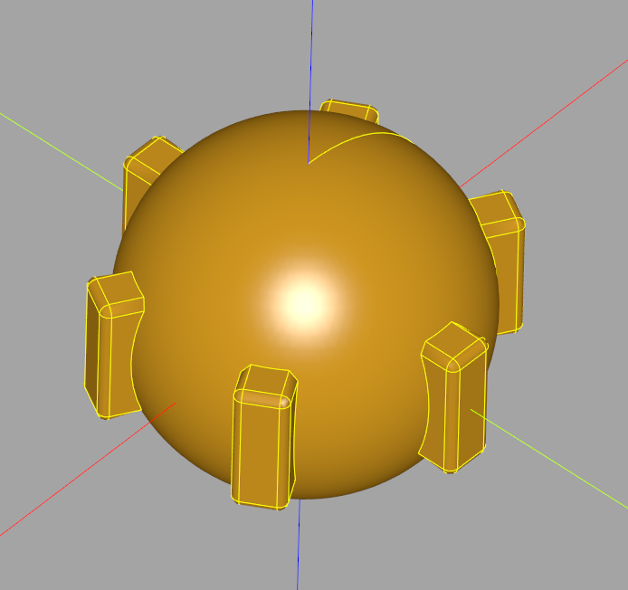

# more_selectors

This plugin provide additionals selectors that can be useful in some situations. Since too much Selectors can be overwhelming they are available here rather than directly in cadquery.
If some of these selectors are judged worth to add to cadquery it may happen also.
If you want to add your own selectors to the plugin you can do it by opening a pull request

## Installation

To install this plugin, the following line should be used.

```
pip install -e "git+https://github.com/CadQuery/cadquery-plugins.git#egg=more_selectors&subdirectory=plugins/more_selectors"
```
You can also clone the repository of the plugin and run in the repository the following command :
```
python setup.py install
```

## Dependencies

This plugin has no dependencies other than the cadquery library.

## Usage

To use this plugin after it has been installed, just import it and use the selectors as regular cadquery selectors

```python
# Import the Hollow Sphere Selector
import cadquery as cq
from more_selectors import HollowSphereSelector

result = (cq.Workplane().sphere(10)
                        .polarArray(10,0,360,6, rotate=True)
                        .box(3,3,8)
                        .edges(
                            HollowSphereSelector((0,0,0), 15, 10, debug= True)
                        )
                        .fillet(0.5))

```
