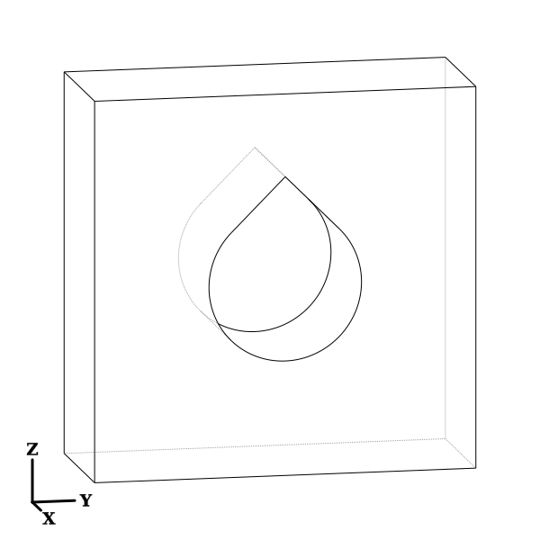
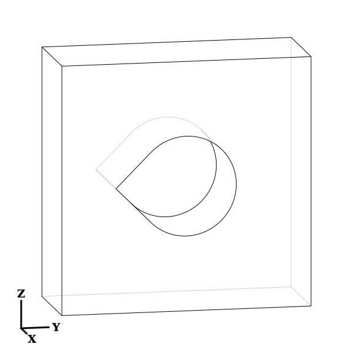
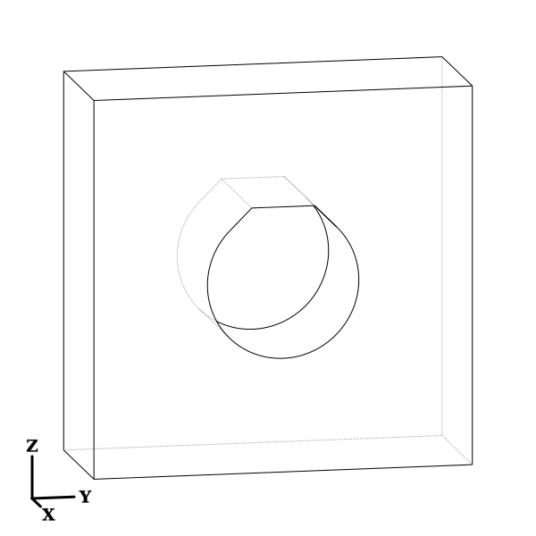
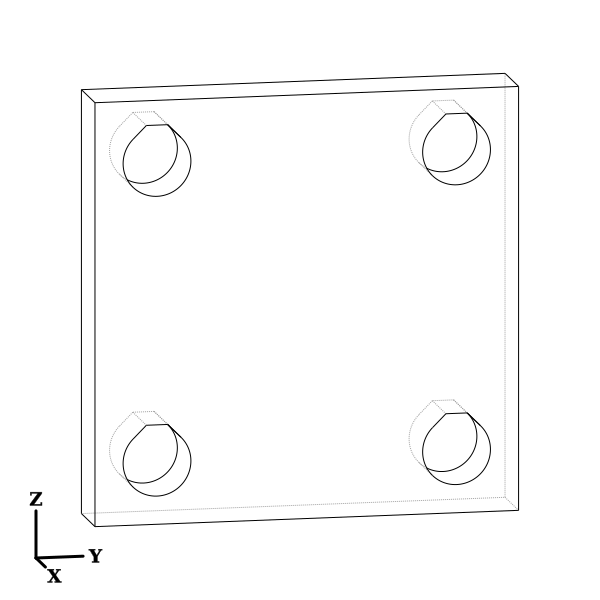

# Teardrop

Generates a teardrop shape.  The application is in making horizontal holes for 3D printed Fused Filament Fabrication (FFF) parts to reduce the overhang angle during printing.  The top of the teardrop shape can be clipped to create a flat top to be bridged in 3D printing.

## Installation

```
pip install -e "git+https://github.com/CadQuery/cadquery-plugins.git#egg=teardrop&subdirectory=plugins/teardrop"
```
You can also clone the repository of the plugin and run in the repository the following command:
```
python setup.py install
```

## Usage

To use this plugin, import it to automatically patch the `teardrop` method into the `cadquery.Workplane` class. The `teardrop` function should be available after import, but be sure to import `cadquery` first.  

Call `teardrop` followed by `cutThruAll` to make a teardrop shaped hole.

```python
import cadquery as cq
import teardrop  # Adds the teardrop function to cadquery.Workplane

r = (
    cq.Workplane("XY")
    .box(8, 20, 20)
    .faces(">X")
    .workplane()
    .teardrop(4)
    .cutThruAll()
)

```




### Rotation to align with model orientation

The first argument is the radius, the second argument is rotation angle. Specify the rotation angle to adjust for model orientation as needed.

```python
r = (
    cq.Workplane("XY")
    .box(8, 20, 20)
    .faces(">X")
    .workplane()
    .teardrop(4, 90)
    .cutThruAll()
)
```




### Truncated teardrop

A third argument `clip`, provides for a truncated flat-topped teardrop shape.  Specify the clip value as the distance along the line from center to vertex.  A truncated teardrop shape can save space at the top of a horizontal hole where small gaps can be bridged in FFF 3D printing.

```
rad = 4
r = (
    cq.Workplane("XY")
    .box(8, 20, 20)
    .faces(">X")
    .workplane()
    .teardrop(rad, 0, clip=rad)
    .cutThruAll()
)
```



The clip value must not exceed the distance from center to vertex.

Small and negative clip values are allowed, however, the result may not be useful as the characteristic top of the teardrop shape is gone.  A clip value of zero would result in a half-circle shaped hole.  The minimum clip value must be greater than -radius.


### Usage with polarArray

When calling polarArray, specify rotate=False to keep the same orientation for all arrayed items.

```
rad = 4
r = (
    cq.Workplane("XY")
    .box(8, 50, 50)
    .faces(">X")
    .workplane()
    .polarArray(25, 45, 360, 4, rotate=False)
    .teardrop(rad, 0, rad*1.1)
    .cutThruAll()
)
```

